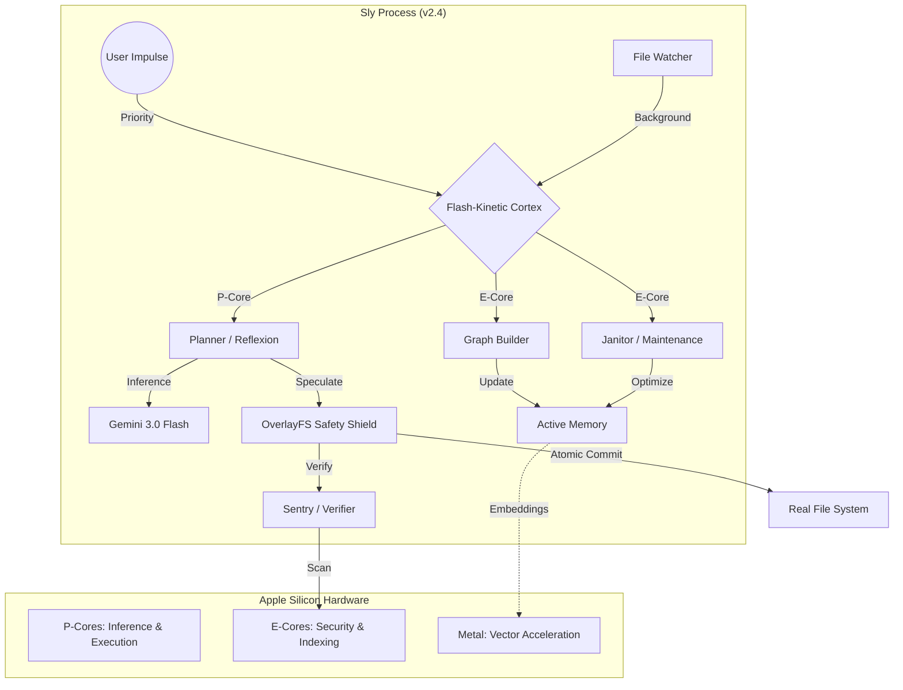

# Architecture: Sly v2.4 (Godmode)

## Core Philosophy: "Maximum Intelligence, Zero Vulnerabilities"

Sly operates as a **high-velocity, SecOps-hardened cybernetic organism** optimized for Apple Silicon. We follow the **Hickey Strategic Doctrine** (Simplicity & Decomplection) to build the "Vim of Agents."

### Strategic Foundation (The Hickey Lens)

1.  **Temporal Decoupling**: The **Cortex** is a pure conduit. Its role is routing, not execution. By separating impulse reception from execution handlers, we eliminate temporal braiding.
2.  **Identity vs. Value**: **OverlayFS** treats the filesystem as a sequence of immutable snapshots. Every specualtive action yields a new "Value" of the codebase, leaving the process "Identity" untangled.
3.  **Data-Orientation**: All internal engine communication (Reflexion, Knowledge, Janitor) occurs via "dumb" data (Structs/Enums). We prioritize unentangled roots over complex object taxonomies.
4.  **Vim Philosophy**: Composition over Monoliths. We transform data through small, ortho-gonal functions: `Impulse -> Context -> Action`.

## Component Breakdown

### 0. `Cortex` (The Nervous System)
- **Role**: Event-Driven Coordination & QoS with **Variable Thinking**.
- **Location**: `src/core/cortex.rs` & `src/core/loop.rs`.
- **Implementation**: 
    - **QoS**: Biased `tokio::select!` loop with dual channels (`Priority` vs `Background`).
    - **Reasoning**: `ThinkingLevel` enum controls Gemini 3.0 Flash effort (High/Low/Minimal).
- **v2.4 Hardening**: System instructions are resident in the Cortex, enforcing the "Godmode" identity across all models.

### 1. `OverlayFS` (The Safety Shield)
- **Role**: Transactional Filesystem Isolation ("Speculative Execution").
- **Location**: `src/safety/overlay.rs`.
- **Logic**: All `WriteFile` directives target a Copy-on-Write overlay. No changes reach the real filesystem without a `Commit` after passing the **Crucible** (verification tests).

### 2. `ActiveMemory` (The Hippocampus)
- **Role**: Graph-Guided Vector Store (CozoDB).
- **Implementation**: Metal-accelerated embeddings via `candle`. Neighborhood expansion replaces brute-force RAG.

### 3. `The Sentinel` (Security Gate)
- **Role**: Automated Linting & Safety Audits.
- **Tools**: `cargo clippy`, `SemanticLinter`, and parallel persona-based **Debates** (Security vs Performance).

### 4. `The Swarm` (Concurrency)
- **Role**: Multi-core delegation.
- **Logic**: Spawns background Workers to handle large-scale refactors or deep documentation ingest without blocking the main event bus.

## Data Flow

1. **User Turn**: Input is captured or polled from `TASKS.md`.
2. **Context Assembly**: `Codebase` + `Vector Memory` + `Session History`.
3. **Prompting**: Construction of the "Mega-Prompt".
4. **Inference**: Sent to **Gemini 3.0 Flash** (with 2.5 Fallback).
5. **Speculation**: Proposed edits are staged in **OverlayFS**.
6. **Verification**: Build check (if applicable) and Diff generation.
7. **Execution**: If safe/approved, changes are committed to the real workspace.
8. **Memory Update**: Interaction is logged for the Janitor.
