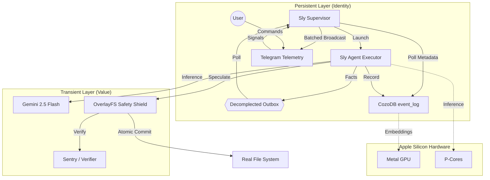

# Architecture: Sly v2.5 (Godmode & Decomplected)

## Core Philosophy: "Maximum Intelligence, Zero Vulnerabilities"

Sly operates as a **high-velocity, SecOps-hardened cybernetic organism** optimized for Apple Silicon. We follow the **Hickey Strategic Doctrine** (Simplicity & Decomplection) to build the "Vim of Agents."

### Strategic Foundation (The Hickey Lens)

1.  **Temporal Decoupling**: The **Cortex** is a pure conduit. Its role is routing, not execution. By separating impulse reception from execution handlers, we eliminate temporal braiding.
2.  **Identity vs. Value**: **OverlayFS** treats the filesystem as a sequence of immutable snapshots. Every specualtive action yields a new "Value" of the codebase, leaving the process "Identity" untangled.
3.  **Data-Orientation**: All internal engine communication (Reflexion, Knowledge, Janitor) occurs via "dumb" data (Structs/Enums). We prioritize unentangled roots over complex object taxonomies.
4.  **Vim Philosophy**: Composition over Monoliths. We transform data through small, ortho-gonal functions: `Impulse -> Context -> Action`.
5.  **Decomplection & Workspace Hygiene**: Formal separation of source code ("Value") from transient build state ("Garbage"). We maintain a minimal indexing surface by explicitly ignoring accidental complexity like `/target`, `node_modules`, and agent metadata.

## Component Breakdown

### 0. `Cortex` (The Nervous System)
- **Role**: Event-Driven Coordination & QoS with **Variable Thinking**.
- **Location**: `src/core/cortex.rs` & `src/core/loop.rs`.
- **Implementation**: 
    - **QoS**: Biased `tokio::select!` loop with dual channels (`Priority` vs `Background`).
    - **Reasoning**: `ThinkingLevel` enum controls Gemini 3.0 Flash effort (High/Low/Minimal).
- **v2.4 Hardening**: System instructions are resident in the Cortex, enforcing the "Godmode" identity across all models.

### 1. `OverlayFS` (The Safety Shield)
- **Role**: Transactional Filesystem Isolation ("Speculative Execution").
- **Location**: `src/safety/overlay.rs`.
- **Logic**: All `WriteFile` directives target a Copy-on-Write overlay. No changes reach the real filesystem without a `Commit` after passing the **Crucible** (verification tests).

### 2. `ActiveMemory` (The Hippocampus)
- **Role**: Graph-Guided Vector Store (CozoDB).
- **Implementation**: Metal-accelerated embeddings via `candle` (**BGE**). Neighborhood expansion replaces brute-force RAG. 
- **Reliability**: Hardened Datalog query generation with robust character escaping and recursive retry logic to handle DB locks.

### 3. `The Sentinel` (Security Gate)
- **Role**: Automated Linting & Safety Audits.
- **Tools**: `cargo clippy`, `SemanticLinter`, and parallel persona-based **Debates** (Security vs Performance).

### 5. `The Supervisor` (Identity Guard)
- **Role**: Process Persistence, Remote Control, & Health Monitoring.
- **Location**: `src/core/supervisor.rs`.
- **Implementation**: 
    - **Persistence**: Managed via macOS `LaunchAgents`.
    - **Concurrency**: Uses **Read-Only transient DB connections** to poll the `event_log` without interfering with the Executor's write-locks.
    - **Telemetry**: 
        - **Decomplected Outbox**: High-priority facts bypass the DB via a filesystem-based outbox (`.sly/outbox/`), eliminating database lock contention.
        - **Semantic Batching**: Intelligent grouping that condenses identical events (e.g., 50x ERRORs) into single reports per cycle.
        - **Interactive Formats**: Formatted Telegram notifications for artifacts (plans, tasks, walkthroughs) with inline lifecycle management.
    - **Resource Optimization**: 
        - **Lightweight Access**: Uses `Memory::new_light` to skip expensive GPU/Embedding initialization during background polling.
        - **Adaptive Polling**: Rate-limiting and lookback controls to prevent Telegram throttling and reduce idle CPU load.
    - **Observability**: Remote log streaming (`/logs`) and multi-level crash detection.
    - **Auto-Heal (Circuit Breaker)**: Smart retry policy that suspends healing if the agent crashes 3 times within 10 minutes.
    - **Singleton Enforcement**: PID-aware file locking (`.sly/supervisor.lock`) for safe multi-session management.
